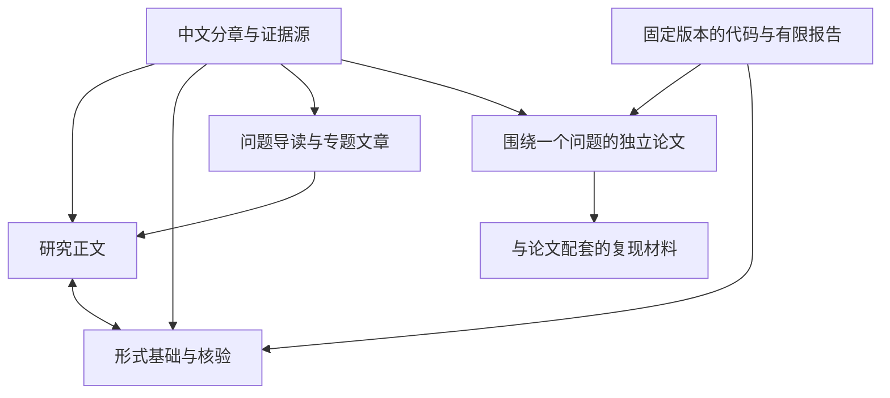

# MCS 专稿：阅读与发布入口

#MCS #研究出版 #阅读导航

**从“怎样让同一份数学支持不同学习入口”进入，再按问题深入定义、证明和实现。** 本次将专稿组织为导读、研究正文、形式基础与核验、独立论文、复现材料五种相互引用的交付物。中文分章仍是理论修订源，英文论文单独维护自己的论证。

当前状态：**2026-10-02，本地编排试读版；2026-10-05 已形成 P1 定位候选**。新目录与导读已落实；正文沿用现有分章，尚未逐章完成叙事改写。P1 的贡献清单、相关工作对照和新论文提纲是编辑候选，尚未取得作者确认或独立审阅。公开网址、DOI、投稿和同行评审均没有取得或核验，不以本地文件存在代替发布记录。

## 选一个入口

| 你现在想知道什么 | 从这里开始 | 读完后能做什么 |
| --- | --- | --- |
| 为什么需要 MCS？ | [导读：同一份数学，为什么需要不同入口](导读.md) | 区分数学资源、个人状态与学习路线，理解一个具体失败例 |
| 整部专稿怎样连起来？ | [研究正文·编排试读版](releases/2026-10-02-r1/MCS-研究正文.md) | 沿问题、资源、路线、视图、案例与边界阅读 |
| 定义和结论凭什么成立？ | [形式基础与核验·编排试读版](releases/2026-10-02-r1/MCS-形式基础与核验.md) | 回查元理论、演算、语义、接口、证据和原编号 |
| 学术论文主张是什么？ | [现有英文稿及其材料](../arxiv/README.md) → [新的论文定位](发布总纲.md) | 区分已存在的候选稿与下一轮编辑目标 |
| 怎样复核有限结果？ | [英文稿复现说明](../arxiv/README.md) / [认证实现入口](../validation/certification/README.md) | 找到输入、运行命令与适用范围 |
| 接下来先做什么？ | [推进计划](推进计划.md) | 按验收条件推进，知道何时缩减主张或延后投稿 |

两册保留原章节和定理编号，并附原分章快照；其补充材料链接仍有指向当前仓库的部分。因此目前适合在本工作区审阅，**尚不是可以脱离仓库分发的完整出版包**。正文中的既有“本轮”日期属于原章节的证据历史，不因重新编排而更新。

## 发布架构



箭头表示来源与阅读关系，是编辑设计（DEF），不表示这些交付物已经对外发布。

## 维护入口

- [发布总纲](发布总纲.md)：定位、读者、形式、渠道与公开表达。
- [内容编排](内容编排.md)：两册目录、全部原章映射、下一轮改写要求。
- [推进计划](推进计划.md)：优先级、产物、依赖、验收与退出条件。
- [版本与发布协议](版本与发布协议.md)：证据、版本、历史保留、发布状态。
- [P1-01 贡献清单](P1-贡献清单.md)：主张、依赖、证据与删减建议。
- [P1-02 相关工作对照](P1-相关工作对照.md)：五项来源的定点阅读与中心问题差异。
- [P1-03 论文提纲](P1-论文提纲.md)：候选题目、建议结构与节段迁移。
- [P1 交付记录](交付记录-20261005-P1.md)：本轮实际完成、检查结果与未验证范围。
- [P1 版本清单](P1-manifest.json)：本轮三个产物与论文源的 SHA-256。
- [P3-01 保持定理预审](P3-01-保持定理逐条件审阅.md)：定理 6.2 的逐条件与证明步骤工作底稿。
- [P3-02 有界搜索覆盖](P3-02-有界搜索与实现覆盖.md)：定理 8.2 与 route_demo.py 的假设—实现覆盖表。
- [P3 交付记录](交付记录-20261005-P3.md)：本轮预审范围、发现与未验证项。
- [P3 版本清单](P3-manifest.json)：论文源、实现源和两份预审文件的 SHA-256。
- [编排清单](catalog.json)：生成两册的唯一编排源。
- [构建脚本](build.py)：检查来源覆盖，生成新目录，拒绝覆盖已有版本。
- [本轮交付与核验](交付记录-20261002.md)：实际改动、运行结果及未验证范围。

在仓库根目录执行：

```powershell
python .\mcs-foundations\publication\build.py --check
python .\mcs-foundations\publication\build.py --build 2026-10-02-r2
python .\mcs-foundations\publication\build.py --verify 2026-10-02-r1
python .\mcs-foundations\publication\test_build.py
```

`r2` 是示例中的**新**版本名，不是默认发布目标。`--check` 检查当前编排和本地链接；`--build` 冻结源文件并生成两册；`--verify` 校验已有快照哈希与链接，并单独报告当前源文件是否已变化。这些命令都不上传内容，也不认证数学论证。

旧的[顺序整合版](../edition/MCS-完整理论专稿.md)继续作为按原章序核对的入口。旧中文 TeX/PDF 不列入本次试读成果；英文 PDF 仍只代表其原候选稿。
