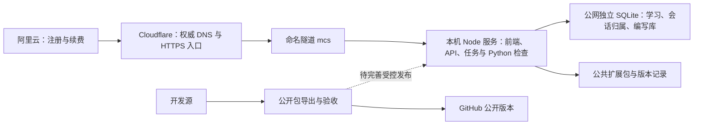

# MCS 后续工作规划：从固定域名可访问到可靠运行

更新：2026-10-09（北京时间），与 [当前待办](../TODO.md) 的子项编号对齐。
正式入口：[mathcognitivespace.com](https://mathcognitivespace.com/)。

**下一步优先整站恢复与运行副本隔离，同时补齐真实账号、别名跳转和真机验收。**
第八十八轮的视图库改动已于 2026-10-09 发布并完成公网核对；已有实现和仍待使用证据分开记录。

## 1. 最新成果与证据边界

| 项目 | 核对状态 | 证据与下一步 |
| --- | --- | --- |
| 固定公网入口 R4a | 已完成，本轮匿名复核通过 | 根域登录页、健康接口 200，匿名档案 401；仅代表本次请求 |
| 主域名统一 R4b-1 | 待做 | www 英文深链仍直接 200，需保留路径/查询参数跳到根域并复测 OAuth |
| 自启与进程守护 R4b-2 | 部分完成 | 10-07 有故障恢复与单实例演练；真正电脑重启及持续可用性尚未验收 |
| 视图数据连续性 | 10-07 已上线 | 本机视图迁入档案、公网保存修复；严格回归 44/44，见第八十七轮 |
| 视图库整理 | 2026-10-09 已上线 | 搜索、排序、同名提示、快照说明随全量 45/45 发布，公网资源哈希核对通过；见第八十九轮 |
| 公开导出 R3a | 本轮修复并实际导出通过 | 精确排除预览目录，保留其他联接拦截；清理一处内部称呼，不放宽禁用词检查；公开内容仍需人工复核 |
| GitHub 公开源码 | 2026-10-09 已同步 | `main` 由 `248508a6` 推到 `fa28118`（干净导出包 555 文件、严格全量通过后推送）；候选构建入口资源与线上同名同哈希；分支保护与 CI 仍缺（R3c 直推） |
| 运行副本 R3b / CI R3c | 待做 | 服务仍运行开发目录；远端规则本轮未复核，不能把 10-05 的查询写成最新结果 |
| 版本与回退 R3d | 部分完成 | 前端已发布：入口哈希切换、78 份资源核对、旧资源与 `previous-dist` 留作回退；整站（前后端 + 配置）匹配回退与公开源码同步仍缺 |
| 整站恢复 R1 / 真实账号 R2 | 待验收 | 前端备份不等于数据恢复；HTTPS 测试替身不等于正式域名双账号 |
| 小米平板 R6a | 待真机证据 | 第八十二至八十六轮实现与自动化检查保留，不能据此销掉闪白/顶栏真机问题 |
| 数学与认知边界 | 持续遵守 | 极限关系的开放假设仍是 R5；测试通过不证明教学收益或一般布局性质 |

本轮发布与检查见 [验收记录](../VALIDATION.md) 第八十九轮（前端发布与公网核对）与第九十轮（公开源码同步；
第八十八轮的实现与专项记录保留在该轮）；
10-05 的 DNS、初始部署与早期核对保留在 [历史核对记录](规划核对记录-20261005.md)。
不重复购买域名、建立隧道或重新做首次上传。

## 2. 当前架构与后续选择

**两条动机**：学习者需要再次打开网站仍能找回记录；维护者需要把运行版本和恢复点核对清楚。
演进链调整为「临时地址 → 固定域名已接通 → 可恢复且可追踪的运行 → 按需求迁入常驻托管」。

- **近期默认**：保留当前 Cloudflare 命名隧道与本机后端；单实例运行，电脑与隧道必须保持运行。
- **先补运行隔离**：当前启动脚本仍直接使用开发目录 `E:\MCS\mcs-web`，不是从不可变发布包运行。
  R3 需设计独立运行副本与固定启动版本，数据和秘密放在代码副本之外；先演练，再切换。
- **数据边界**：当前显式自托管使用持久磁盘上的独立 SQLite；PostgreSQL 是已实现、未在真实云端验收的后续选项。
  编写库和扩展文件不能因更换学习数据库就被遗漏。
- **迁移触发条件**：需要电脑关机后仍可访问、多人持续使用、现有网络/容量反复成为障碍，或明确获得运维收益时，评估常驻托管。
- **Vercel 保留两种选择**：前端加同源代理到常驻后端；或在任务、编写库、扩展与证书环境全部适配后再迁入后端。
  两种都需独立预览数据和联调，前端部署成功不等于整站完成。[Vercel 重写](https://vercel.com/docs/routing/rewrites)

| 路线 | 本轮定位 | 推进条件 |
| --- | --- | --- |
| Cloudflare 命名隧道 + 本机服务 | 已接通，近期继续完善 | 恢复演练、受控更新、连续可用性、电脑重启后的恢复 |
| 常驻后端 + 持久存储 | 需要脱离个人电脑时评估 | 费用和网络可接受；新旧数据、归属、草稿、扩展完整迁移且可回退 |
| Vercel 前端 + 常驻后端 | 后续可选 | 预览/发布收益明确；Host、Origin、Cookie、CSRF 与任务轮询联调通过 |
| Vercel 全后端 | 更后期适配 | 共享任务状态与持久化完成，不依赖进程内 Map 或临时本地文件 |

## 3. 域名工作从“接入”转为“收口”

**阿里云继续管理注册、续费与 NS 设置；当前网站解析记录在 Cloudflare 管理。**
权威 NS 已指向 Cloudflare，不能继续照旧规划在阿里云云解析添加记录并期待它控制当前网站。
这是对公开 NS 查询的判断，管理原理见 [Cloudflare 权威域名服务器说明](https://developers.cloudflare.com/dns/nameservers/)。

1. **保留已生效的委派与命名隧道**：不重复购买、建同名隧道或重新跑一次性配置；留存非敏感配置说明和受保护凭据备份。
2. **统一主入口**：根域作为唯一学习入口；www 以及实际使用的 mcs 别名先检查用途，再在边缘配置保留路径和查询参数的永久重定向。
   www 目前只是可读，不据此认定从该来源写入也可用。
3. **核对新域名登录**：应用 publicOrigin、Supabase Site URL 与 redirectTo 对齐根域。
   当前 OAuth 回调带动态 state，需完成真实登录、退出及一次保存/重读；不只核对配置文字。
4. **精确回调边界**：应用落点为 `https://mathcognitivespace.com/api/v2/auth/callback`；
   GitHub OAuth App 仍回 Supabase 的 `/auth/v1/callback`。按需要启用邮箱确认落点 `/auth/confirm`。
5. **复核访问差异**：检查一次 403 的原因；从至少一种桌面和一种手机网络观察 HTTPS、页面、健康接口。
   记录请求时间与结果，不能从几次请求推导长期稳定。
6. **证明可恢复**：在安排好的窗口验证源站、隧道与电脑重启后的恢复过程；记下断网/关机行为。
   开机自启与进程守护已于 2026-10-07 设置，并做了服务崩溃、隧道崩溃、单实例、模拟登录自启
   与停止语义的演练（命令、结果与未验证边界见 [`_ops/runtime/README.md`](../../_ops/runtime/README.md)）；
   **真实重启电脑后的恢复仍未验证**，脚本启动成功也不等于整站可恢复。

新域名登录验收完成后，再清理不再使用的临时回调白名单；测试环境与正式用户数据隔离。
[Supabase 回调配置](https://supabase.com/docs/guides/auth/redirect-urls)

## 4. 按完成条件推进，不再重复排期已完成工作

上一版六周表是接入前估算。现在采用工作批次；每批达标再进入下一批，R1 与 R4b 可并行准备。

| 次序 | 工作 | 本批完成标准 | 不重复做的已有成果 |
| --- | --- | --- | --- |
| 当前已完成 | R0、R4a、R3a；第八十二至八十七轮及本轮专项 | 历史公开包独立验收；固定根域匿名访问；视图迁移、公网保存、触屏优化及本轮导出审查有记录 | 不重复建设；移动端“实现已验证”和“真机已确认”分别记录 |
| **第一批 P0** | R1 整站恢复；R2 + R4b 使用与域名收口；R6a 真机复测 | 在新目录恢复记录、归属、草稿和扩展；新域名双账号隔离；别名统一与重启恢复；小米平板横竖屏核对闪白、顶栏和双指操作，并记录实际前端版本 | 沿用已有登录、存储、命名隧道与触屏修复；真机复测可并行 |
| **第二批 P0** | R3b/c/d 可追踪发布 | 独立运行副本；开发源→候选包→公开分支/PR→检查→受控切换；记录版本/备份点并实做前后端匹配回退 | R3a 已精确排除预览目录且实际导出通过；每次候选仍重新审查 |
| **第三批 P1** | R5 证据缺口；R6b 学习体验积欠 | 先闭合极限关系的真实声明与证书；补必要组件约定检查；一条教学路径完整可走 | 本机视图迁入档案已上线；保留节点、网络、动画与删除确认 |
| **第四批 P2** | R7 小规模试用 | 3–5 人围绕一个案例使用；记录卡点、误解和回看问题，形成下一批有复现证据的任务 | 不把完成率当作教学收益证明 |
| 按需求启动 | R8 长期托管、邮件、DeepTutor | 有明确需求、维护收益与真实联调证据再推进 | 不为平台迁移重写已有 React/Vite 前端 |

### R6a：先把已有触屏修复验收闭合

先记录正式页面实际加载的前端资源哈希，确认包含第八十二至八十六轮触屏修复，再复测；健康接口本体哈希不足以识别前端版本。
在小米平板 Edge 上记录型号、浏览器版本、横竖屏与网络条件，完整上下滚动首页并切换页面，核对闪白、顶栏消失、末幕入口与文字遮挡；网络页检查双指缩放、抬起一指后继续平移、误拖节点与长按冲突。
桌面端同时抽查既有舞台和鼠标操作，减少动态效果设置也应保持可用。

通过条件是上述真实操作可完成且报告的问题未复现，留下对应版本和结果；若仍复现，记录步骤与画面，按同设备、同场景比较修复前后。
第八十六轮降频模拟的帧间隔 18.2ms → 12.2ms 只作为工程参考，不换算为真机帧率承诺。
暂不以删除插画或未经复测的渲染开关继续追逐分数；已知首绘长帧按真实影响决定后续优化。

### R5 的证据状态须精确到“目标”与“关系”

第六十四轮曾记录极限证书型关系成功；第七十五轮核查发现关系所声明的前提没有出现在证书开放假设里，随后移除了该关系通道。
**底层目标可被检查器证明，不等于它已成为声明准确、可重放和可发布的关系。**
当前端到端测试仍把 `limit` 列为唯一已知缺口；测试通过不能擦掉这个例外。

下一步先设计符合真实开放假设的无条件/有条件关系表达，再走发现、独立重放、发布与撤回。
完成后移除该案例的已知缺口条目；不放宽检查器，不恢复已撤下的前提声明。
等价桥梁的完整形式化与反例有限对象登记另列，不合并成一句“极限案例已全部证明”。

### 内容与体验方向

- 理论仍以分章 Markdown 为修订源，公开试读、一般证明、有限检查和界面实现分开记账。
- 做深一个教学案例：两条动机 → 胚子到定义 → 条件反例 → 概括证明 → 应用 → 回看。
- 笔记流水线生成件先归档，再核对数学、引用与节点映射；账本 completed 不自动触发网站发布。
- 保留多条可选路线，区分已读、作答与确认掌握；视图迁移已有实现，接下来核对真实账号的数据连续性。
- 收到真实试用反馈后再扩大节点数量、模型辅导或复杂交互；工程回归不替代学习效果证据。

## 5. 更新维护的工作分工

**一条需求，一项验收，一次可回退的发布。**

- TODO 的 R 系列记录当前优先级；VALIDATION 记录实际证据；RELEASE-READINESS 只摘要当前状态。
- 远程 GitHub、导出候选包、运行中的开发源是三个状态；每次发布分别记录，不能拿一个提交号替代全部。
- 最新规划文档先在本地维护，经过导出审查与发布后才算进入公开版本；GitHub main 当前仍为 `248508a`。
- CI 先在干净公开包执行，再配置 main 必需检查；一个人的项目不设置无法满足的自审批准。
- CI 配置应明确权威源与导出条目：现导出器尚无根级 `.github/`、`vercel.json` 专门复制规则。
- `.tmp-shadow` 已按精确目录规则排除并重新导出通过，其他联接仍拦截；每次发布重新检查候选，不能把一次导出通过当作永久豁免。
- R3 的运行副本隔离也必须覆盖静态文件和公共扩展的路径；不把用户数据库复制进代码候选包。
- 日常发布步骤见 [维护与更新](维护与更新.md)；Vercel 适配条件见 [GitHub 与 Vercel](GITHUB-VERCEL.md)。

## 6. 维护节奏与下一步

| 频率 | 动作 | 留下的证据 |
| --- | --- | --- |
| 每次修改 | 对应检查、预览核对、证据状态更新 | 明确版本的结果与边界 |
| 每次发布 | 一致备份、固定候选、受控切换、正式冒烟、回退版本 | 提交、运行版本、本体哈希、备份编号 |
| 每日巡检（待配置） | 根域 HTTPS、健康接口、源站/隧道与备份新鲜度 | 仅持续故障、恢复或需要处理时通知 |
| 每周 | 错误与反馈分类、备份核对 | 下一批优先任务 |
| 每月 | 隔离恢复、依赖与容量、域名续费检查 | 实际恢复用时及未覆盖部分 |

备份保留期建议起点仍为每日 7 份、每周 4 份、每月 3 份，并有受保护异机副本；
RPO ≤24 小时、RTO ≤4 小时仅是待验证目标，未设置定时任务、删除策略或对外承诺。

**下一批具体交付**：整站恢复报告；正式域名双账号验收表；别名重定向与访问差异结论；小米平板真机复测记录。
同时准备运行副本隔离和公开包 CI，安排一次有备份点、有版本号的发布与回退演练。

回看问题：用户换一天打开能否继续学习？电脑或发布出问题能否恢复？证书证明的到底是哪个目标、哪些前提？
思想：以已实现且可核对的成果作为规划起点。方法：分开记录访问、功能、数据与数学证据（第 1、3、4 节），按恢复和发布验收推进（第 5、6 节）。
